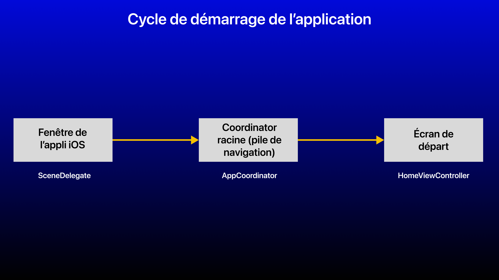

# iOS (Swift 5): Exemple du pattern Coordinator avec UIKit (MVVM et MVP)

Le Coordinator est un design pattern qui a fait beaucoup parler de lui dans le développement **iOS**, il est également assez populaire dans les projets en entreprise. Particularité, il s'utilise avec **UIKit** et principalement avec l'architecture **MVVM**, d'où l'acronyme **MVVM-C**. Ou bien encore avec **MVP**, donnant ainsi l'acronyme **MVP+C**.

Dans ce repo, je propose 2 implémentations avec **MVVM-C** et **MVP+C**.

### Un peu d'histoire

En 2015, d'un constat de nombreuses responsabilités qu'un `ViewController` peut avoir entre la logique métier, la logique visuelle et la logique de navigation, **Soroush KHANLOU** conçoit un design pattern qu'est le `Coordinator` afin de séparer la logique de navigation du `ViewController`.

## Introduction

Avant d'aborder en profondeur le pattern `Coordinator`, il est important d'en connaître sa définition et de savoir l'expliquer de manière simple et concrète, le jour de l'entretien technique (souvent exigeant).

### Rappelons d'abord qu'est-ce qu'un design pattern ?

Un design pattern est une solution éprouvée et réutilisable à un problème commun de conception de logiciel. Il s'agit d'un modèle général de conception de code qui peut être adapté et réutilisé dans différents projets pour résoudre des problèmes similaires.

Les design patterns sont souvent utilisés pour résoudre des problèmes de conception courants dans la programmation orientée objet, tels que la création d'objets, la gestion des relations entre les objets, la structuration du code, la gestion des erreurs, ...

Ils permettent de produire un code plus clair, plus maintenable et plus réutilisable, tout en réduisant les erreurs et en améliorant l'efficacité du développement de logiciels.

Exemple: Singleton, Factory, injection de dépendances, délégation, observateur, Decorator, Coordinator, ...

### Qu'est-ce qu'un Coordinator ?

Le Coordinator est un pattern qui organise la logique de flux de navigation entre les différents écrans (`ViewController`) et qui isole la logique de navigation de l'interface utilisateur. 

Les écrans sont donc plus facilement réutilisables et gérables afin d'ajuster le flux de navigation que ce soit:
- Dans un cas classique, ici de passer d'un écran à un autre ou bien par un flux bien défini.
- Dans un cas spécifique où par exemple lors qu'on est redirigé directement vers un écran par le biais d'un deeplink (lien profond) (que ce soit avec une notification utilisateur ou depuis un widget).

### Quel est en est l'intérêt ?

Comme on le constate, si on se base sur la logique de l'architecture **MVC (Model View Controller)** d'Apple, c'est dans le `ViewController` qu'on y met toute la logique: création de la vue, navigation vers d'autres écrans et gestion de la logique métier pour actualiser la vue. 

Mais le problème est que le `ViewController` devient massif à force d'une complexité grandissante si l'écran concerné a de plus en plus de fonctionnalités et donc la possibilité de naviguer vers plusieurs écrans. La lisibilité et la maintenabilité en devient donc plus difficile. De même pour la testabilité vu qu'il y aura trop de couplage avec les différentes logiques que le `ViewController` va directement dépendre, il sera donc très difficile voire impossible de tester la logique avec des tests unitaire.

Des architectures comme **MVVM (Model View ViewModel)** ou **MVP (Model View Presenter)** vont déjà résoudre une grande partie du problème en y isolant la logique métier, mais s'il faut respecter les principes du SOLID et particulièrement le premier étant le principe de responsabilité unique, ça restera insuffisant. 

Le `Coordinator` est donc l'une des possibles options pour gérer le flux de navigation et donc d'isoler la logique de navigation entre les vues. Il y en a d'autres comme le routeur (`Router`), et l'architecture **VIPER** en est un exemple qui implémente cette façon de naviguer.

## Implémentation

Ce pattern présente pas mal de confusions au niveau de son implémentation. En effet, en recherchant sur Google et YouTube, il y a différentes implémentations de celui-ci, certaines sont simples, d'autres complexes à comprendre et à implémenter. Selon moi, ce design pattern donne beaucoup de fil à retordre pour l'apprendre, le comprendre et l'implémenter, étant donc l'un des patterns les plus complexes.

Il y a de bonnes chances que l'implémentation qu'on apprend soit différente de celle appliquée sur un projet dans une entreprise, auquel cas on pourrait être déboussolé au début.

Je propose ici un exemple avec un écran d'accueil, une vue liste et une vue détail pour la mise en application de ce pattern.

### Important

Toute utilisation de ce pattern doit utiliser `AppDelegate` ou `SceneDelegate` pour le flux de départ. Et également, si le `Storyboard` est utilisé, l'utilisation des `segue` est à proscrire.

### Structure du Coordinator

Pour l'implémentation de ce pattern, on va définir 2 protocoles, un pour le `Coordinator` et un autre pour celui qui sera le parent du `Coordinator` enfant. 2 protocoles sont définis car on souhaite respecter le 4ème principe du SOLID qui est la ségrégation d'interfaces où une classe implémentant un protocole qu'avec ce qu'il a besoin.

On définit dans le premier protocole `Coordinator`, 2 attributs et 3 méthodes dont 2 qui seront optionnels à réimplémenter.

```swift
import UIKit

protocol Coordinator: AnyObject {
    var childCoordinators: [Coordinator] { get set }
    var navigationController: UINavigationController { get }
    
    func start()
    func addChildCoordinator(childCoordinator: Coordinator)
    func removeChildCoordinator(childCoordinator: Coordinator)
}

extension Coordinator {
    // Ajout d'un coordinator enfant au parent, le parent aura une référence sur le coordinator enfant
    func addChildCoordinator(childCoordinator: Coordinator) {
        self.childCoordinators.append(childCoordinator)
    }

    // Supprime un coordinator enfant depuis le parent
    func removeChildCoordinator(childCoordinator: Coordinator) {
        // Il faut bien vérifier la référence entre les coordinators, on utilise du coup === au lieu de ==.
        self.childCoordinators = self.childCoordinators.filter { $0 !== childCoordinator }
    }
}
```

- `navigationController`: La logique de navigation va donc se faire dans un `UINavigationController` et les transitions peuvent se faire aussi bien avec `push` qu'avec `present` (si on n'a pas besoin de la barre de navigation, qu'on veut une transition modale).
- `childCoordinators` représente les sous-flux du `Coordinator` actuel, chaque `Coordinator` faisant office de parent aura comme mission de gérer les références entre les `Coordinator` parent et enfant. Le cas pratique le plus pertinent est lors de l'utilisation d'un `TabBarController` en bas de l'écran où il peut y avoir plusieurs `ViewController`, chacun d'entre eux ayant son propre flux (`Coordinator`). Il y a donc ici une arborescence entre le flux principal (`Coordinator` parent) et les sous-flux (`Coordinator` enfants), qui eux-même peuvent respectivement avoir des relations vers d'autres sous-flux.
- `start()` sera la méthode qui instanciera le `ViewController` et qui affichera l'écran de départ ou effectuera la transition d'un écran à un autre.

Les 2 méthodes dans l'extension du protocole vont s'appliquer à l'ensemble des `Coordinator` concrets implémentant le protocole, ces comportement seront les mêmes, faisant ainsi en sorte qu'il n'est pas obligatoire de réimplémenter ces méthodes.
- `addChildCoordinator()`: Cette fonction va ajouter un sous-flux de navigation depuis le `Coordinator` actuel qui aura donc une relation (référence) avec le `Coordinator` enfant.
- `removeChildCoordinator()`: Cette fonction va supprimer un sous-flux de navigation depuis le `Coordinator` actuel lorsque l'écran associé au `Coordinator` enfant est détruit. Cette fonction est importante pour la gestion mémoire afin d'éviter les memory leaks.

On définit dans le second protocole `ParentCoordinator`, un attribut pour un `Coordinator` enfant (sous-flux) ayant une relation avec un `Coordinator` parent. Le but ici est de maintenir une relation entre 2 `Coordinator` quand il faut par exemple faire passer des données (notamment vers le précédent écran).

```swift
protocol ParentCoordinator: AnyObject {
    var parentCoordinator: Coordinator? { get }
}
```
- `addChildCoordinator()`: Cette fonction va ajouter un sous-flux de navigation depuis le `Coordinator` actuel qui aura donc une relation (référence) avec le `Coordinator` enfant.
- `removeChildCoordinator()`: Cette fonction va supprimer un sous-flux de navigation depuis le `Coordinator` actuel lorsque l'écran associé au `Coordinator` enfant est détruit. Cette fonction est importante pour la gestion mémoire afin d'éviter les memory leaks.

### Racine de la navigation

Une fois les protocoles définis, on va créer le `Coordinator` principal, qu'on nommera `AppCoordinator`.

On commence par mettre en place le design pattern de la délégation (`delegate`) avec un protocole qui permettra à `AppCoordinator` d'être plus facilement testable, du fait qu'il est indépendant du `ViewController`. On respecte donc ainsi 2 principes du SOLID qui sont:
- 4ème principe du SOLID (I) étant la ségrégation d'interfaces, où une classe implémentant un protocole qu'avec ce qu'il a besoin.
- 5ème et dernier principe du SOLID (D) étant l'inversion de dépendances, où les abstractions ne doivent pas dépendre des détails. Les détails devraient dépendre des abstractions.

### Rappelons très rapidement ce qu'est la délégation.

La délégation est un pattern qui permet à une classe de déléguer certaines de ses responsabilités à une autre classe.

Elle facilite donc la communication entre classes et délivre des messages d'un objet à un autre lorsqu'un événement spécifique se déclenche.

La délégation se met en place par le biais d'un protocole. La classe qui délègue aura une référence faible (weak) vers la classe qui exécutera les méthodes du protocole et fera les appels des méthodes de ce dernier. La classe qui impléméntera les méthodes du protocole aura une référence vers la classe qui délègue.

Apple utilise ce pattern dans des éléments de UIKit qu'on utilise souvent comme par exemple `UITableViewDelegate`, `UITableViewDataSource`, `UICollectionViewDelegate`, `UICollectionViewDataSource`, `UISearchBarDelegate`, ...

On définit donc le protocole ci-dessous, on définit une méthode que `AppCoordinator` implémentera derrière. Et que `HomeViewController` aura comme référence pour être en relation avec `AppCoordinator`.

```swift
// On respecte les 4ème et 5ème principe du SOLID de la ségrégation d'interface et de l'inversion de dépendances
protocol HomeViewControllerDelegate: AnyObject {
    func goToListView()
}
```

Dans l'exemple ci-dessous, voici la définition de la racine du flux de navigation de l'app iOS, `AppCoordinator`.

On y adopte 2 protocoles `Coordinator` et `ParentCoordinator` car `AppCoordinator` est le point de départ du flux de navigation et qui aura donc des relations avec d'autres écrans.

Commençons avec le premier protocole `Coordinator`, où les 2 attributs `navigationController` et `childCoordinators` sont définis.

L'affectation de la référence de `navigationController` s'effectuera par injection de dépendance avec un initialiseur. Dans ce cas particulier, c'est ici que la racine de la navigation est définie.

Dans la méthode `start()`, on y définira l'écran de départ à chaque fois que l'application démarre. Le flux peut varier si par exemple l'accès aux fonctionnalités de l'application nécessite une authentification utilisateur, c'est-à-dire s'il n'est pas connecté, l'écran de départ sera une interface de connexion. S'il est connecté, l'écran de départ sera un écran d'accueil.

Pour définir l'écran de départ, on instancie donc le `ViewController` concerné et on y affecte une référence avec `AppCoordinator` (on fera très attention à la rétention de cycle). Pour l'instanciation, vous pouvez le faire soit par `Storyboard`, ou bien de manière programmatique en y définissant un initialiseur dans le `ViewController`. On peut aussi effectuer des injections de dépendances si par exemple le `ViewController` a des attributs où par exemple elle dépend d'un `ViewModel` ou d'un `Presenter` dans le cadre d'une architecture **MVVM** ou **MVP**.

Pour terminer, on effectue la transition avec `navigationController` sans animation pour cette première vue, avec `push` pour ajouter le premier écran dans la pile de navigation.

Dans le second protocole `HomeViewControllerDelegate`, on définit le comportement de la méthode pour effectuer la navigation de l'écran de départ vers un autre écran, ici dans l'exemple `goToListView()`. On abordera plus tard dans l'article les détails pour la transition.

```swift
// Le principal Coordinator de l'app, la racine même du flux de navigation.
final class AppCoordinator: Coordinator {    
    // Sous-flux
    var childCoordinators = [Coordinator]()
    private(set) var navigationController: UINavigationController
    
    init(with navigationController: UINavigationController) {
        self.navigationController = navigationController
    }
    
    func start() {
        print("[AppCoordinator] Instanciation de la vue de départ")
        
        // Pour la testabilité et l'indépendance
        let homeViewController = HomeViewController.instantiate(storyboardName: "Main") ?? HomeViewController()
        homeViewController.coordinator = self
        
        // Pas d'animation pour l'écran de départ.
        print("[AppCoordinator] HomeViewController prêt.")
        navigationController.pushViewController(homeViewController, animated: false)
    }
}

extension AppCoordinator: HomeViewControllerDelegate {
    func goToListView() {
        // La transition est séparée ici dans un sous-flux
        let listCoordinator = ListCoordinator(navigationController: navigationController)
        
        // Ajout du lien vers le parent avec self, attention à la rétention de cycle
        listCoordinator.parentCoordinator = self
        addChildCoordinator(childCoordinator: listCoordinator)
        
        // On transite de l'écran liste à l'écran détail
        listCoordinator.start()
    }
}
```

Voici comment s'implémente le `ViewController`. On y définit un attribut ayant une référence vers `AppCoordinator` de manière indirecte et découplée via `HomeViewControllerDelegate` afin d'effectuer d'éventuelles actions comme naviguer vers un autre écran. 

**ATTENTION:** Il y a un cycle de références du fait que `AppCoordinator` ait une référence forte (strong) de `navigationController` qui lui même a une référence vers `HomeViewController` dans sa pile de navigation. `HomeViewController` a quant à lui une référence vers `AppCoordinator` par le biais de `HomeViewControllerDelegate`. Cette référence sera donc faible (`weak`) car il ne faut pas que `HomeViewController` ait une rétention de `AppCoordinator`, pour également éviter les fuites de mémoire (`memory leak`), si l'écran est détruit.


Lorsqu'on voudra aller vers un autre écran, c'est donc depuis la référence de `coordinator`, ici `coordinator?.goToListView()` dans l'exemple pour aller de `HomeViewController` vers `ListViewController`.
```swift
// L'écran principal de l'application
final class HomeViewController: UIViewController, Storyboarded {
    
    // Il faut que le ViewController puisse communiquer avec le Coordinator pour les différentes transitions de navigation.
    // Attention à la rétention de cycle, ici: HomeCoordinator -> UINavigationController -> HomeViewController -> HomeCoordinator
    weak var coordinator: HomeViewControllerDelegate?
    
    override func viewDidLoad() {
        super.viewDidLoad()
        // Do any additional setup after loading the view.
        let backBarButton = UIBarButtonItem(title: "Retour", style: .plain, target: nil, action: nil)
        navigationItem.backBarButtonItem = backBarButton
    }

    @IBAction func goToListScreen(_ sender: Any) {
        coordinator?.goToListView()
    }
}
```

Pour l'instanciation du `ViewController` depuis un `Storyboard`, voici une possibilité, à condition ici que le nom du `ViewController` soit le même que son `StoryboardID`.
```swift
// Ce protocole permet à un ViewController de s'instancier depuis un Storyboard
protocol Storyboarded {
    static func instantiate(storyboardName: String) -> Self?
}

/*
-> Avec une extension sur le protocole, on définit un comportement par défaut sur une fonction, ici instantiate.
-> De plus, le ViewController adoptant le protocole Storyboarded n'aura pas l'obligation de réimplémenter.
-> ATTENTION: Bien définir dans le Storyboard l'identifiant de Storyboard (Storyboard ID) le nom de classe du ViewController concerné. L'appli crashera sinon si le cas où c'est nil n'est pas géré.
*/
extension Storyboarded where Self: UIViewController {
    static func instantiate(storyboardName: String) -> Self? {
        // Ça retourne "<NomApp>.<Nom>ViewController"
        let fullName = NSStringFromClass(self)

        // Le nom complet est séparé par le point en plusieurs chaînes, donnant le nom de la classe du ViewController
        let className = fullName.components(separatedBy: ".")[1]

        // Si plusieurs Storyboards sont utilisés dans un projet, ce qui peut être possible. Sinon, c'est Main s'il y en a un seul, à moins qu'il soit renommé.
        let storyboard = UIStoryboard(name: storyboardName, bundle: Bundle.main)

        // Instancie un ViewController avec ce même identifiant et retournant le type demandé. Self: le type courant du contexte actuel, ici le ViewController qui adopte ce protocole.
        guard let viewController = storyboard.instantiateViewController(withIdentifier: className) as? Self else {
            print("Le ViewController \(className) n'a pas pu être détecté dans le Storyboard \(storyboardName). Assurez-vous que le ViewController \(className) soit défini et que son StoryboardID soit défini sur \(className).")
            return nil
        }
        
        return viewController
    }
}
```

Dernière étape, on définit le point de départ, soit depuis:
- `AppDelegate` dans la méthode `application(_ application: UIApplication, didFinishLaunchingWithOptions launchOptions: [UIApplicationLaunchOptionsKey: Any]?)`
- `SceneDelegate` dans la méthode `scene(_ scene: UIScene, willConnectTo session: UISceneSession, options connectionOptions: UIScene.ConnectionOptions)` (iOS 13 ou plus requis).

Ici, on va définir par exemple avec `SceneDelegate` une référence vers le `Coordinator` (flux) principal. Et dans la méthode `scene()`, on définit la fenêtre qui y contiendra la vue racine. On déclare un attribut pour la racine de navigation, ici `AppCoordinator` car il faut ici garder une référence forte (`strong`) pour tout le cycle de vie de l'application.

Voici le cycle d'initialisation de l'application avec le `Coordinator`:
1) On récupère la scène de la fenêtre.
2) On créé une instance de `UINavigationController`.
3) On affecte une instance de `AppCoordinator` à l'attribut `coordinator` en y injectant dans l'initialiseur le `UINavigationController` initialisé précédemment.
4) On appelle la méthode `start()` de `coordinator` qui va instancier l'écran de départ et ajouter cet écran dans la pile de navigation, ici le `UINavigationController` injecté.
5) On créé la fenêtre (`UIWindow`) en y injectant les dimensions de la scène de la fenêtre.
6) On affecte à la vue racine de la fenêtre (`rootViewController`) la propriété `navigationController` de `coordinator`, ce conteneur de navigation contenant ici le premier écran dans sa pile.
7) On fait appraître l'écran avec `makeKeyAndVisible()`.

```swift
class SceneDelegate: UIResponder, UIWindowSceneDelegate {

    var window: UIWindow?
    var coordinator: AppCoordinator?

    // C'est ici qu'on va mettre en place la racine de la logique de navigation, le Coordinator parent, étant aussi le point d'entrée de l'application.
    func scene(_ scene: UIScene, willConnectTo session: UISceneSession, options connectionOptions: UIScene.ConnectionOptions) {
        guard let windowScene = (scene as? UIWindowScene) else { return }
        
        // Le NavigationController principal à être utilisé dans l'app
        let navigationController = UINavigationController()
        
        // C'est d'ici qu'on démarre l'application et donc ici qu'on démarre avec le coordinator.
        print("Initialisation Coordinator")
        coordinator = AppCoordinator(with: navigationController)
        coordinator?.start()
        
        print("Ouverture de la première vue")
        window = UIWindow(frame: windowScene.coordinateSpace.bounds)
        window?.windowScene = windowScene
        
        // Si on définit le point d'entrée de manière programmatique, la fenêtre doit avoir une vue racine définie, ici le NavigationController où des vues y seront poussées.
        window?.rootViewController = coordinator?.navigationController
        window?.makeKeyAndVisible()
    }
}
```

Ci-dessous un schéma récapitulatif du flux de navigation.



Voici donc ci-dessous l'écran lorsqu'on démarre l'application.


## Implémentation des sous-flux

Maintenant, on veut implémenter une transition vers un autre écran, ici de l'écran d'accueil vers l'écran de la liste. Pour cela, il faut créer un `Coordinator` dédié à l'écran de la liste qu'on nommera dans l'exemple `ListCoordinator`.

Dans l'implémentation ci-dessous, on reprend la même implémentation que dans celle de `AppCoordinator` mais avec des éléments en plus. En premier lieu, `ListCoordinator` est un sous-flux, on y ajoute donc une référence vers `AppCoordinator` par le biais de l'abstraction `ParentCoordinator`. 

**ATTENTION:** La référence de `ListCoordinator` vers `AppCoordinator` doit être faible (`weak`) car `AppCoordinator` a une référence forte de `ListCoordinator` depuis `childCoordinators` (le tableau de `Coordinator`). On évite encore une fois la rétention de cycle (fuite de mémoire).


L'initialiseur est similaire, mais on va ici lors de l'injection de dépendance injecter le `UINavigationController` de `AppCoordinator`, sinon cela créera une nouvelle pile de navigation et le flux de navigation sera alors difficile voire impossible à gérer.

Pour la méthode `start()`, le processus reprend ceux de `AppCoordinator`. Ici dans l'exemple, on effectuera aussi des injections de dépendances, car `ListViewController` suit une logique de l'architecture **MVVM**, on y injecte donc une instance d'un `ViewModel` pour la gestion de la logique métier, ici télécharger des données. On n'oublie pas aussi la référence de `ListCoordinator`.

Cet écran a 3 possibilités:
- On peut revenir en arrière vers l'écran d'accueil: la méthode `backToHomeView()` va permettre au flux parent, ici `AppCoordinator` de supprimer la référence vers `ListCoordinator`. J'ai mis ici un bloc `deinit` (pas nécessaire, mais utile pour le débug) pour vérifier qu'il n'y a plus d'instances de `ListCoordinator` lorsque `ListViewController` est détruit, afin de vérifier qu'il n'y a pas de fuite de mémoire.
- On peut afficher la vue détail d'un élément lorsque qu'on a sélectionné une cellule, c'est donc là qu'on peut faire passer des données, ici avec la méthode `goToDetailView(with viewModel: PhoneViewModel)`.
- On peut afficher une alerte lorsqu'il y a eu une erreur depuis le `ViewModel`.

Encore une fois, on va appliquer le pattern de la délégation, avec un protocole qui permettra à `ListCoordinator` d'être plus facilement testable, du fait qu'il est indépendant du `ViewController`. On respecte encore une fois le 4ème principe du SOLID (ségrégation d'interface) et 5ème principe du SOLID (l'inversion de dépendances).

```swift
// On respecte les 4ème et 5ème principe du SOLID de la ségrégation d'interface et de l'inversion de dépendances
protocol ListViewControllerDelegate: AnyObject {
    func backToHomeView()
    func goToDetailView(with viewModel: PhoneViewModel)
    func displayAlertErrorMessage(with errorMessage: String)
}
```

Ci-dessous la classe `ListCoordinator`, adoptant les 3 protocoles (`Coordinator`, `ParentCoordinator` et `ListViewControllerDelegate`)
```swift
final class ListCoordinator: Coordinator, ParentCoordinator {
    // Attention à la rétention de cycle, le sous-flux ne doit pas retenir la référence avec le parent.
    weak var parentCoordinator: Coordinator?
    private(set) var navigationController: UINavigationController
    var childCoordinators = [Coordinator]()
    
    init(navigationController : UINavigationController) {
        print("[ListCoordinator] Initialisation")
        self.navigationController = navigationController
    }
    
    // À titre d'exemple pour vérifier que lorsqu'on retourne sur l'écran d'accueil qu'il n'y a pas de memory leak.
    deinit {
        print("[ListCoordinator] Coordinator détruit.")
    }
    
    // Définition du point d'entrée
    func start() {
        print("[ListCoordinator] Instanciation de la vue de la liste.")
        let listViewController = ListViewController.instantiate(storyboardName: "Main") ?? ListViewController()

        // Délégation par ListViewController, attention à la rétention de cycle
        listViewController.coordinator = self
        
        // On n'oublie pas de faire l'injection de dépendance du ViewModel
        listViewController.viewModel = ListViewModel(with: NetworkAPIService())
        
        print("[ListCoordinator] Navigation vers la vue de la liste.")
        navigationController.pushViewController(listViewController, animated: true)
        print(navigationController.viewControllers)
    }
}

// On respecte les principes de ségrégation d'interface et d'inversion de dépendances du SOLID.
extension ListCoordinator: ListViewControllerDelegate {
    func backToHomeView() {
        print("[ListCoordinator] Retour à l'écran d'accueil: suppression du coordinator.")
        
        // Nettoyage du coordinator enfant
        parentCoordinator?.removeChildCoordinator(childCoordinator: self)
        print(navigationController.viewControllers)
    }
    
    func goToDetailView(with viewModel: PhoneViewModel) {
        // La transition est séparée ici dans un sous-flux
        let detailCoordinator = DetailCoordinator(navigationController: navigationController, viewModel: viewModel)
        
        // Ajout du lien vers le parent avec self, attention à la rétention de cycle
        detailCoordinator.parentCoordinator = self
        addChildCoordinator(childCoordinator: detailCoordinator)
        
        // On transite de l'écran liste à l'écran détail
        detailCoordinator.start()
    }
    
    func displayAlertErrorMessage(with errorMessage: String) {
        print("[ListCoordinator] Affichage d'une alerte.")
        
        let alert = UIAlertController(title: "Erreur", message: errorMessage, preferredStyle: .alert)
        
        alert.addAction(UIAlertAction(title: "OK", style: .default, handler: { _ in
            print("OK")
        }))
        
        navigationController.present(alert, animated: true, completion: nil)
    }
}
```

Concernant la transition de `HomeViewController` vers `ListViewController`, on injectera l'ici l'instance actuelle de `AppCoordinator` et on ajoutera aussi dans la liste des sous flux `listCoordinator`. `AppCoordinator` est le flux parent de `ListCoordinator` et il sera important notamment lors d'un retour en arrière où on quitte `ListViewController`.

```swift
// Le principal Coordinator de l'app, la racine même du flux de navigation.
final class AppCoordinator: Coordinator {
    // Sous-flux
    var childCoordinators = [Coordinator]()
    var navigationController: UINavigationController
    ... 
    func goToListView() {
        // La transition est séparée ici dans un sous-flux
        let listCoordinator = ListCoordinator(navigationController: navigationController)
        
        // Ajout du lien vers le parent avec self, attention à la rétention de cycle
        listCoordinator.parentCoordinator = self
        addChildCoordinator(childCoordinator: listCoordinator)
        
        // On transite de l'écran liste à l'écran détail
        listCoordinator.start()
    }
}
```

Voici ci-dessous comment `ListViewController` s'implémente et comment les différentes transitions de navigation s'effectuent avec la référence vers `ListCoordinator`.

Si `push` a été utilisé pour que `ListViewController` soit dans la pile de navigation, la particularité est le bouton retour de la barre de navigation. Si on ne peut pas créer une fonction gérant cet événement, on va donc appeler la fonction de retour dans `viewWillDisappear()` afin d'effectuer le nettoyage des références, ici `ListViewController` et `ListCoordinator` sont détruits. **ATTENTION:** il faut s'assurer qu'on gère correctement l'événement où la vue est retirée de la pile, donc avec `isMovingFromParent` car `viewWillDisappear()` se déclenche aussi quand un autre `ViewController` se met au-dessus de lui (ici `isMovingToParent`).

 Dans le cas où une vue serait présentée modalement (avec `present`) et qu'on déclenche la fermeture depuis une fonction (via un bouton par exemple), c'est donc par une méthode dans le `Coordinator` qu'on effectuera cette fermeture avec `dismiss()`.

 **RAPPEL:** Il y a un cycle de références du fait que `ListCoordinator` ait une référence forte (strong) de `navigationController` qui lui même a une référence vers `ListViewController` dans sa pile de navigation. `ListViewController` a quant à lui une référence vers `ListCoordinator` par le biais de `ListViewControllerDelegate`. Cette référence sera donc faible (`weak`) car il ne faut pas que `ListViewController` ait une rétention de `ListCoordinator`, pour également éviter les fuites de mémoire (`memory leak`), si l'écran est détruit.

```swift
final class ListViewController: UIViewController, Storyboarded {
    
    @IBOutlet weak var searchBar: UISearchBar!
    @IBOutlet weak var tableView: UITableView!
    
    // Il faut que le ViewController puisse communiquer avec le Coordinator pour les différentes transitions de navigation.
    // Attention à la rétention de cycle, ici: ListCoordinator -> UINavigationController -> ListViewController -> ListCoordinator
    weak var coordinator: ListViewControllerDelegate?
    var viewModel: ListViewModel?
    private var iPhoneViewModels = [PhoneViewModel]()
    ...
    override func viewDidLoad() {
        super.viewDidLoad()
        ...
        viewModel?.fetchiPhonesData()
    }
    
    // ATTENTION: Cela se déclenche aussi bien lorsque l'écran est détruit que lorsque qu'il y a un écran qui va aller au-dessus de celui-ci.
    override func viewWillDisappear(_ animated: Bool) {
        // On s'assure qu'on fait bien un retour vers l'écran précédent
        if isMovingFromParent {
            coordinator?.backToHomeView()
        }
    }
    ...
    func setBindings() {
        viewModel?.updateBinding = { [weak self] result in
            switch result {
                case .success(let viewModels):
                    self?.iPhoneViewModels = viewModels
                    self?.tableView.reloadData()
                case .error(let message):
                    self?.displayAlertErrorMessage(with: message)
            }
        }
    }
    
    func displayAlertErrorMessage(with errorMessage: String) {
        coordinator?.displayAlertErrorMessage(with: errorMessage)
    }
}
...
extension ListViewController: UITableViewDelegate {
    func tableView(_ tableView: UITableView, didSelectRowAt indexPath: IndexPath) {
        // Navigation vers la vue détail
        coordinator?.goToDetailView(with: iPhoneViewModels[indexPath.row])
    }
}
...
```

Voici donc ci-dessous l'écran de la liste.


### Dernier écran de la pile

Appliquons ensuite le même procédé pour l'initialisation et la transition avec `start()` pour le dernier écran, la vue détail. Une particularité ici, est que la vue détail n'a pas à effectuer de transition vers une nouvelle vue.

Encore une fois, on va appliquer le pattern de la délégation, avec un protocole qui permettra à `DetailCoordinator` d'être plus facilement testable, du fait qu'il est indépendant du `ViewController`. On respecte encore une fois le 4ème principe du SOLID (ségrégation d'interface) et 5ème principe du SOLID (l'inversion de dépendances).
```swift
// On respecte les 4ème et 5ème principe du SOLID de la ségrégation d'interface et de l'inversion de dépendances
protocol DetailViewControllerDelegate: AnyObject {
    func backToListView()
}
```

Ci-dessous la classe `DetailCoordinator`, adoptant les 3 protocoles (`Coordinator`, `ParentCoordinator` et `DetailViewControllerDelegate`)
```swift
import Foundation
import UIKit

final class DetailCoordinator: Coordinator, ParentCoordinator {
    // Attention à la rétention de cycle, le sous-flux ne doit pas retenir la référence avec le parent.
    weak var parentCoordinator: Coordinator?
    
    private(set) var navigationController: UINavigationController
    var childCoordinators = [Coordinator]()
    let viewModel: PhoneViewModel
    
    init(navigationController : UINavigationController, viewModel: PhoneViewModel) {
        print("[DetailCoordinator] Initialisation")
        self.navigationController = navigationController
        self.viewModel = viewModel
    }
    
    deinit {
        print("[DetailCoordinator] Coordinator détruit")
    }
    
    // Définition du point d'entrée
    func start() {
        print("[DetailCoordinator] Instanciation de la vue détail")
        let detailViewController = DetailViewController.instantiate(storyboardName: "Main") ?? DetailViewController()
        
        // Ajout du lien vers le parent avec self, attention à la rétention de cycle
        detailViewController.configure(with: viewModel)
        detailViewController.coordinator = self
        
        print("[DetailCoordinator] DetailViewController prêt.")
        self.navigationController.pushViewController(detailViewController, animated: true)
    }
}

extension DetailCoordinator: DetailViewControllerDelegate {
    func backToListView() {
        // Nettoyage du coordinator enfant
        print("[DetailCoordinator] Retour à l'écran liste: Suppression du coordinator.")
        parentCoordinator?.removeChildCoordinator(childCoordinator: self)
        print(navigationController.viewControllers)
    }
}
```

Voici comment s'implémente `DetailViewController`. On n'oublie pas que c'est comme avec `ListViewController` et qu'il faut faire attention à la rétention de cycle et aussi à la gestion de la transition des vues.

```swift
final class DetailViewController: UIViewController, Storyboarded {
    private var viewModel: PhoneViewModel?
    
    // Il faut que le ViewController puisse communiquer avec le Coordinator pour les différentes transitions de navigation.
    // Attention à la rétention de cycle, ici: DetailCoordinator -> UINavigationController -> DetailViewController -> DetailCoordinator
    weak var coordinator: DetailViewControllerDelegate?
    ...
    override func viewDidLoad() {
        super.viewDidLoad()
        setViews()
    }
    
    // ATTENTION: Cela se déclenche aussi bien lorsque l'écran est détruit que lorsque qu'il y a un écran qui va aller au-dessus de celui-ci.
    override func viewWillDisappear(_ animated: Bool) {
        // On s'assure qu'on fait bien un retour
        if isMovingFromParent {
            coordinator?.backToListView()
        }
    }
    
    func configure(with viewModel: PhoneViewModel) {
        self.viewModel = viewModel
    }
    ...
}
```

Et voici l'écran de la vue détail:


## Conclusion

Voilà donc le pattern `Coordinator` dans sa théorie et comment on peut le mettre en application dans son projet iOS.

Si on doit expliquer de manière simple et concrète en entretien, ce qui est difficile lorsqu'il y a du stress (notamment lorsqu'il faut donner un exemple simple), voici ce qu'on peut en retenir:

Le `Coordinator` est un pattern qui organise la logique de flux de navigation entre les différents écrans (ViewController) et qui isole la logique de navigation de l'interface utilisateur.

L'objectif principal du `Coordinator` est de rendre le code plus modulaire et plus facilement testable en réduisant la dépendance entre les différents composants de l'application. Il permet également de réduire la complexité de l'architecture de l'application en divisant les responsabilités de chaque composant.

Le `Coordinator` se met en place avec une classe contenant des méthodes pour afficher le premier écran (depuis `AppDelegate`), naviguer d'un écran à un autre, et des attributs pour gérer les références entre les différents coordinators (étant des sous-flux). Le principe de communication entre la vue et le `Coordinator` se fait idéalement avec la délégation (`delegate`) afin de bien respecter le 4ème et 5ème principe du SOLID, qui va permettre par exemple de faire passer des données à une précédente vue mais aussi pour faciliter la testabilité et la maintenance du fait que la vue est découplée du `Coordinator`.

On en retiendra que le `Coordinator` est un pattern de flux:
- Qui gère la navigation dans des flux et sous-flux, en allégeant la vue de cette responsabilité.
- Qui permet le découplage des différents écrans afin de faire une navigation sur mesure que ce soit lors des intéractions sur chaque écran, ou bien lors de l'ouverture de l'application avec des deeplinks (liens profonds).
- Qui facilite la testabilité des composants de l'application, chaque flux de navigation pouvant être testé indépendamment, par exemple pour vérifier que les instances sont bien retournées ou bien détruites depuis des tests unitaires.

Mais aussi un pattern difficile à apprendre, à comprendre et à appliquer par soi-même. C'est un pattern qui m'a donné énormément de fil à retordre. Il faut faire très attention à la gestion des références pouvant facilement causer des rétentions de cycles résultant de fuites mémoire (`memory leak`).

Voilà, en espérant que ce repo vous offrira tous les éclaircissements nécessaires pour maîtriser ce design pattern et que vous puissiez intégrer plus facilement un projet exploitant ce pattern, aussi bien avec MVVM (MVVM-C) ou bien MVP (MVP+C), ou encore ces 2 derniers imbriqués dans une Clean Architecture. 

Développeurs et leads iOS expérimentés maîtrisant ce pattern, n'hésitez surtout pas à me faire des retours sur cet article notamment si j'ai oublié des détails. Si cet article est clair et explicite, j'en serai très content :)
